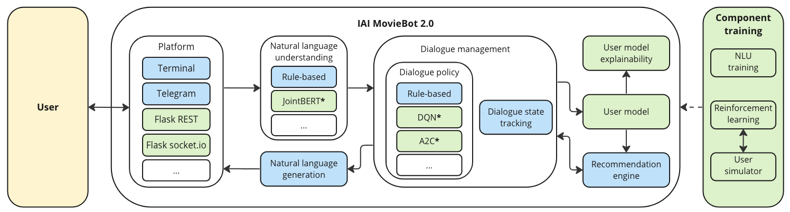
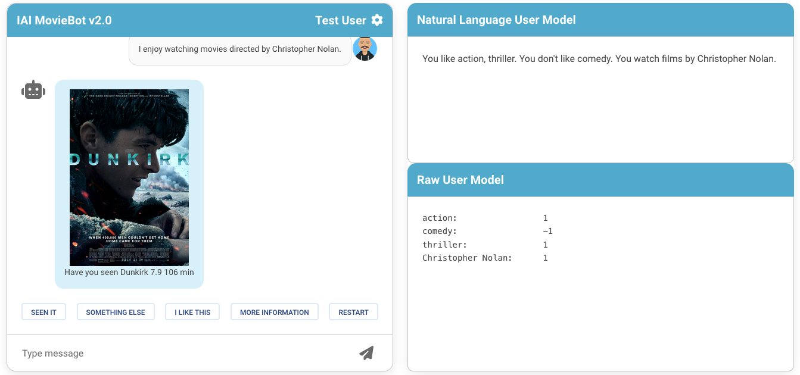
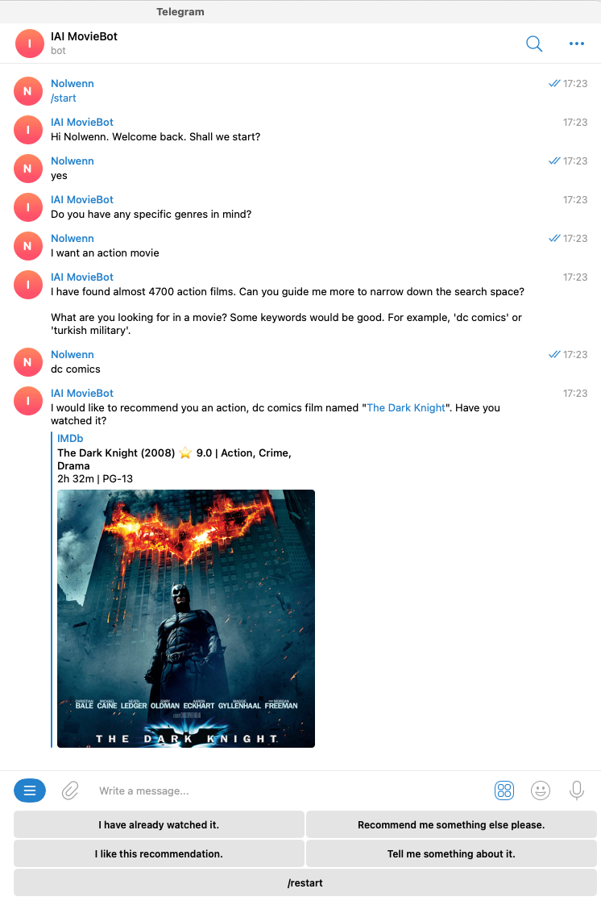

# IAI MovieBot

[](https://github.com/psf/black)
[](https://iai-moviebot.readthedocs.io/en/latest/?badge=latest)


IAI MovieBot is a conversational recommender system for movies. It follows a standard task-oriented dialogue system architecture, comprising natural language understanding (NLU), dialogue manager (DM), and natural language generation (NLG) components. Additionally, it includes a user model and a recommendation engine. Some modules may use different models, which can be trained using the provided training utilities. It also comes with different deployment platforms (such as Telegram and Flask REST).
The distinctive features of IAI MovieBot include a task-specific dialogue flow, a multi-modal chat interface, and an effective way to deal with dynamically changing user preferences. While our current focus is limited to movies, the system aims to be a reusable and extensible development framework that can support users in accomplishing recommendation-related goals via multi-turn conversations.

The v1.0 version of IAI MovieBot has been presented as a demonstration paper at CIKM'20 [[PDF](https://arxiv.org/pdf/2009.03668.pdf)], while the v2.0 version was presented at WSDM'24 [[PDF](https://arxiv.org/pdf/2403.00520.pdf)].

## Versions

Available versions of IAI MovieBot:

  * v2.0 (current version)
  * [v1.1.0](https://github.com/iai-group/MovieBot/releases/tag/v1.1.0)
  * [v1.0.1](https://github.com/iai-group/MovieBot/releases/tag/v1.0.1)
  * [v1.0](https://github.com/iai-group/MovieBot/releases/tag/v1.0.0)

## Installation and usage

Installation and usage instructions are available in the [documentation](https://iai-moviebot.readthedocs.io/).

## Components

Below is the overview of IAI MovieBot 2.0 architecture. Blue components are inherited from IAI MovieBot 1.0 and the green ones are new additions. Training utilities are available for components marked with a star (*).



<!-- TODO: Add link to related documentation pages -->

  * Platform [[doc](https://iai-moviebot.readthedocs.io/en/latest/usage.html)]
    - Terminal
    - Telegram
    - Flask REST
    - Flask socket.io
  * Natural Language Understanding (NLU) [[doc](https://iai-moviebot.readthedocs.io/en/latest/nlu.html)]
    - Rule-based
    - JointBERT
  * Dialogue management [[doc](https://iai-moviebot.readthedocs.io/en/latest/dialogue_manager.html)]
    - Dialogue policy
      + Rule-based
      + Deep Q-Network (DQN)
      + Advantage Actor-Critic (A2C)
    - Dialogue state tracking
  * User model
  * User model explainability
  * Recommendation engine
  * Natural Language Generation (NLG) [[doc](https://iai-moviebot.readthedocs.io/en/latest/architecture.html#natural-language-generation)]

Training utilities:

  * NLU training (JointBERT) [[doc](https://iai-moviebot.readthedocs.io/en/latest/nlu.html#training-the-jointbert-model)]
  * Reinforcement learning training (DQN and A2C) using a user simulator [[doc](https://iai-moviebot.readthedocs.io/en/latest/reinforcement_learning.html)]

## Demos

IAI MovieBot v2.0 can be tried [here](https://gustav1.ux.uis.no/moviebotv2/).



IAI MovieBot v1.0 can be tried on the Telegram channel [@iai_moviebot_bot](https://t.me/iai_moviebot_bot).



## Contributions

Contributions are welcome. Changes to IAI MovieBot should conform to the [IAI Python Style Guide](https://github.com/iai-group/guidelines/tree/main/python).

## Citation

For the most recent version (v2.0) of IAI MovieBot, please cite:

```bibtex
@inproceedings{Bernard:2024:WSDM,
    author = {Bernard, Nolwenn and Kostric, Ivica and Balog, Krisztian},
    title = {IAI MovieBot 2.0: An Enhanced Research Platform with Trainable Neural Components and Transparent User Modeling},
    year = {2024},
    booktitle = {Proceedings of the 17th ACM International Conference on Web Search and Data Mining},
    pages = {1042--1045},
    doi = {10.1145/3616855.3635699},
    series = {WSDM '24}
}
```

For the v1.0 version of IAI MovieBot, please cite:

```bibtex
@inproceedings{Habib:2020:CIKM,
    author = {Habib, Javeria and Zhang, Shuo and Balog, Krisztian},
    title = {IAI {MovieBot}: {A} Conversational Movie Recommender System},
    year = {2020},
    booktitle = {Proceedings of the 29th ACM International Conference on Information and Knowledge Management},
    pages = {3405--3408},
    doi = {10.1145/3340531.3417433},
    series = {CIKM '20}
}
```

## Contributors

IAI MovieBot is developed and maintained by the [IAI group](https://iai.group/) at the University of Stavanger.

(Alphabetically ordered by last name)

  * Javeria Habib (2020)
  * Krisztian Balog (2020-present)
  * Nolwenn Bernard (2022-present)
  * Ivica Kostric (2021-present)
  * Weronika Łajewska (2022-present)
  * Martin G. Skjæveland (2022)
  * Shuo Zhang (2020)
