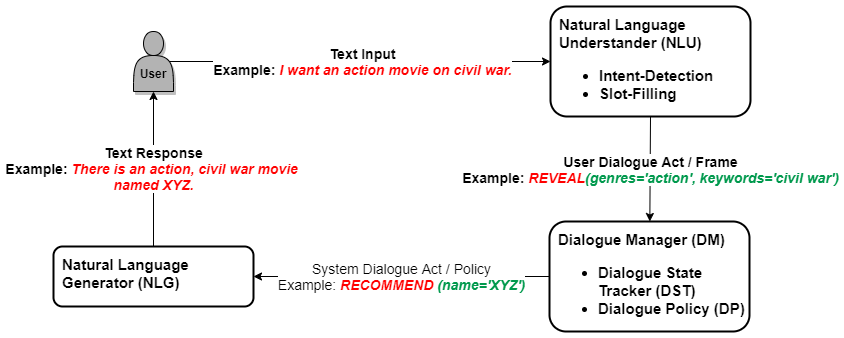

System Architecture
===================

This page provides a high-level overview of the architecture of our system.  At this level of abstraction, our system constitutes a domain-independent framework for facilitating conversational item recommendation.  Thus, even though we will be using movie-related examples for illustration, it is straightforward to adapt the system to other domains.

The system architecture is shown in the figure below, illustrating the core process for each dialogue turn.




Natural Language Understanding
------------------------------

The :py:class:`NLU <moviebot.nlu.nlu>` component converts the natural language :py:class:`UserUtterance <moviebot.core.utterance.utterance.UserUtterance>` into a :py:class:`DialogueAct <moviebot.dialogue_manager.dialogue_act>`. This process, comprising of *intent detection* and *slot filling*, is performed based on the current dialogue state. The component offers two distinct solutions as modules: Rule-Based and Neural using JointBERT.

Rule-Based NLU
^^^^^^^^^^^^^^

The rule-based NLU module utilizes a combination of keyword extraction and heuristics to determine the user's intent and extract slot-value pairs from their utterances. This approach relies on predefined rules and patterns to interpret user input.

Neural NLU with JointBERT
^^^^^^^^^^^^^^^^^^^^^^^^^^

The Neural NLU module employs JointBERT, a neural model trained for predicting both the intent of the user's utterance and the corresponding slot-value pairs.

Training the JointBERT Model
^^^^^^^^^^^^^^^^^^^^^^^^^^^^

To train the JointBERT model, the provided training script (`moviebot/nlu/annotation/joint_bert/joint_bert_train.py`) can be utilized. This script downloads a pre-trained BERT model (`bert-base-uncased`) and fine-tunes it on a dataset annotated with intents and slot-value pairs. Below is an overview of the training process:

1. **Data Preparation**: Ensure the dataset is properly formatted with annotations for intents and slot-value pairs. The data path should be specified using the `--data_path` argument in the training script.

Example dataset format:
```yaml
REVEAL:
  - text: "[I absolutely adore](modifier) movies focusing on [martial arts](keywords)."
  - text: "Films about [space exploration](keywords) [fascinate me](modifier)."
  - text: "[I can't stand](modifier) movies that emphasize on [corporate politics](keywords)."
  - text: "[Space adventures](keywords) [always intrigue me](modifier)."
```

2. **Model Initialization**: The model is initialized with the number of intent labels and slot labels based on the dataset. Additionally, hyperparameters such as learning rate, weight decay, and maximum epochs may be configured.

3. **Training**: The training script supports logging with [Wandb](https://wandb.ai/site) for easy monitoring of training progress.

4. **Model Saving**: After training, the trained model weights are saved to the specified output path (`--model_output_path`). Additionally, metadata including intent and slot names is saved in a JSON file for reference.

6. **Usage**: Once trained, the JointBERT model can be integrated into the conversational system for natural language understanding tasks, by specifying the model path.


Dialogue Manager
----------------

The :py:class:`DialogueManager <moviebot.dialogue_manager.dialogue_manager>` tracks the dialogue state and decides what action the system should take.  It consists of two sub-components:

- :py:class:`DialogueStateTracker <moviebot.dialogue_manager.dialogue_state_tracker>`, which updates the :py:class:`DialogueState <moviebot.dialogue_manager.dialogue_state>` and :py:class:`DialogueContext <moviebot.dialogue_manager.dialogue_context>` based on the dialogue acts by both the agent and the user.
- :py:class:`DialoguePolicy <moviebot.dialogue_manager.dialogue_policy>`, which generates a dialogue act by the agent based on the current dialogue state. It defines the flow of the conversation, i.e., what steps an agent must take at every stage.


Natural Language Generation
---------------------------

The :py:class:`NLG <moviebot.nlg.nlg>` component converts the output of the :py:class:`DialoguePolicy <moviebot.dialogue_manager.dialogue_policy>` to a natural language response.  Further, this component can (1) summarize the information need back to the user, to help them keep track of their stated preferences and (2) help the user to explore the item space by providing options.
