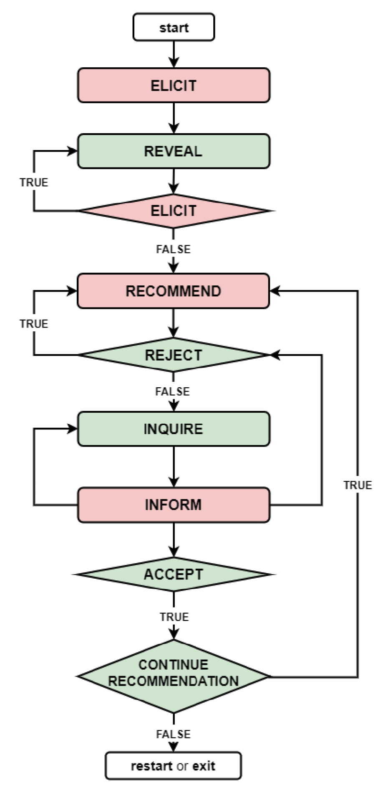

Dialogue Modeling
=================

We assume that recommendations happen via a multi-turn conversation with an *agent*, which is initiated and terminated by the *user*.
The agent keeps eliciting user preferences until (a) the result set is sufficiently small or (b) it has reached the maximum amount of questions it is allowed to ask (to avoid fatiguing the user). Then, the agent makes recommendations for specific items and elicits feedback on them, until the user finds an item to their liking (or terminates the process).

The figure below shows the dialogue flow in our system.

Intents
-------

User intents
"""""""""""""

:py:class:`UserIntents <moviebot.intents.user_intents>`

A detailed description is provided :doc:`here <nlu>`.

Agent intents
"""""""""""""

:py:class:`AgentIntents <moviebot.intents.agent_intents>`

+------------------------+------------+
| Intent   | Description   |
+========================+============+
| Elicit   | Ask the user to describe their preferences.   | 
+------------------------+------------+
| Recommend  | Based on the user's preferences, make a recommendation.        | 
+------------------------+------------+
| No results  | The database does not contain any items matching the user's preferences.        | 
+------------------------+------------+
|  Count results | The number of items matching the user's preferences is larger than a maximum limit. This will be followed by an elicit intent.        | 
+------------------------+------------+
| Inform  | If the user inquires about the recommended item, the agent provides the relevant information.        | 
+------------------------+------------+
| Continue recommendation  | If the user likes a recommendation, they can either restart, quit or continue the process to get a similar recommendation.        | 
+------------------------+------------+
| Restart  | The agent restarts the recommendation process based on the user's wish.        | 
+------------------------+------------+
| Acknowledge  | Acknowledge the user's query where required.        | 
+------------------------+------------+
| Can't help  | The agent does not understand the user's query or is not able to respond properly based on the current dialogue state.        | 
+------------------------+------------+
| Welcome  | Start the conversation by giving a short introduction.        | 
+------------------------+------------+
| Bye  | End the conversation.        | 
+------------------------+------------+

Dialogue Act
------------

User and agent utterances are modeled as :py:class:`DialogueActs <moviebot.dialogue_manager.dialogue_act>`, which are machine-understandable representations of the natural language text.

A dialogue act is mathematically represented as *intent((slot_1, op_1, value_1), ... (slot_n, op_n, value_n))*, where *intents* are the recognized :py:class:`AgentIntents <moviebot.intents.agent_intents>` and :py:class:`UserIntents <moviebot.intents.user_intents>`, and operators (=, !=, <, >, >=, <=) specify the relationship between for each slot and its corresponding value.

Information Need
----------------

The user's preferences are represented as an *information need* (IN). The user can reveal their preferences at any stage in the conversation, which will trigger an update to the IN.
Information needs are represented as slot-value pairs, and get their values assigned based on *reveal* intents. For example, if a user wants a *"romance and comedy movie, starring Meryl Streep from the 90s,"* the IN will be modeled as::

    [
      genres = romance, comedy;
      actors = Meryl Streep;
      release year >= 1990 & < 2000
    ]

Note that some slots can be multi-valued (this is defined by a domain-specific ontology).
Further, it may be that the system attempts to elicit preference for a slot that the user does not care about. Those responses are also registered, but they will not narrow the set of matching items.

If the number of items matching the information need exceeds a predefined threshold, the agent will attempt to elicit additional preferences (i.e., slot values for the IN). For example, if the user states a preference for *action* movies, the agent will follow this up with the following request: *"There are almost 4700 action films. Please answer a few more questions to help me find a good movie...''*

Restarting a conversation will erase the current IN as well as the history of recommended items.
